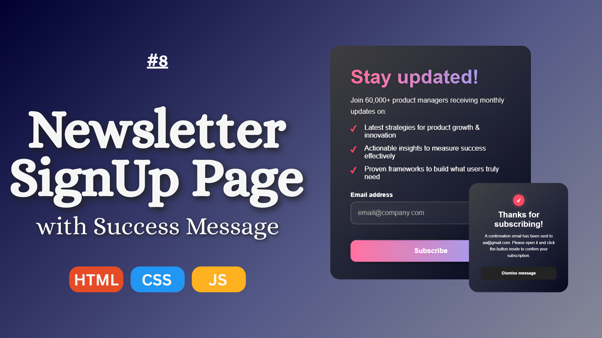

# 📧 Newsletter Signup Page with Success Message  

A **responsive Newsletter Signup Page** built with **HTML, CSS, and JavaScript**, featuring **email validation** and a **success message popup** after form submission.  
This beginner-friendly project is perfect for learning **form validation**, **frontend design**, and **JavaScript interactivity**.  

   

---

## 🚀 Features  

- ✅ Responsive **newsletter signup form**  
- ✅ **Email validation** using JavaScript (regex)  
- ✅ **Success message popup** after form submission  
- ✅ Clean and modern **UI design** with CSS  
- ✅ Beginner-friendly and easy to customize  

---

## 🛠️ Tech Stack  

- **HTML5** – Structure  
- **CSS3** – Styling & Layout  
- **JavaScript (Vanilla JS)** – Validation & Interactivity  

---

## 📂 Project Structure  

newsletter-signup-page/
│── index.html
│── style.css
│── script.js
└── assets/
└── images/

---

## ⚡ Getting Started  

Follow these steps to run the project locally:

---

## ⚡ Getting Started  

Follow these steps to run the project locally:  

### 1️⃣ Clone the repository  
```bash
git clone https://github.com/Syed-Muhammad-Talha/newsletter-signup-page.git
```

### 2️⃣ Navigate to the project folder
```bash
cd newsletter-signup-page
```

### 3️⃣ Open `index.html` in your browser  
```bash
That’s it 🎉 Your **Newsletter Signup Page** will be running locally.  
```
---

## 📸 Demo  

🔗 **YouTube Tutorial:** [Watch on YouTube](https://youtu.be/abcd1234)  

---

## 📚 Learning Outcomes  

By building this project, you’ll learn:  
- How to design forms with **HTML & CSS**  
- How to apply **JavaScript regex validation**  
- How to show a **popup success message** dynamically  
- How to structure a **real-world frontend mini project**  

---

## 🤝 Contributing  

Contributions are welcome! If you’d like to:  
- Report a bug 🐛  
- Suggest a new feature 💡  
- Improve code or documentation ✨  

Feel free to **fork this repo** and submit a **pull request**.  

---

## 📩 Connect With Me  

- 💼 Facebook: DevCraft Projects  
- 📷 Instagram: @devcraftprojects  
- 🎥 YouTube: DevCraft Projects  

---

## 🏷️ Keywords  

`HTML CSS JavaScript Project` • `Newsletter Signup Form` • `Frontend Mini Project` • `Email Validation Form` • `Newsletter Signup with Success Message` • `JavaScript Beginner Project` • `Responsive Form Design`  

---

✨ If you found this project helpful, don’t forget to **star ⭐ this repo** and check out my other projects!  
